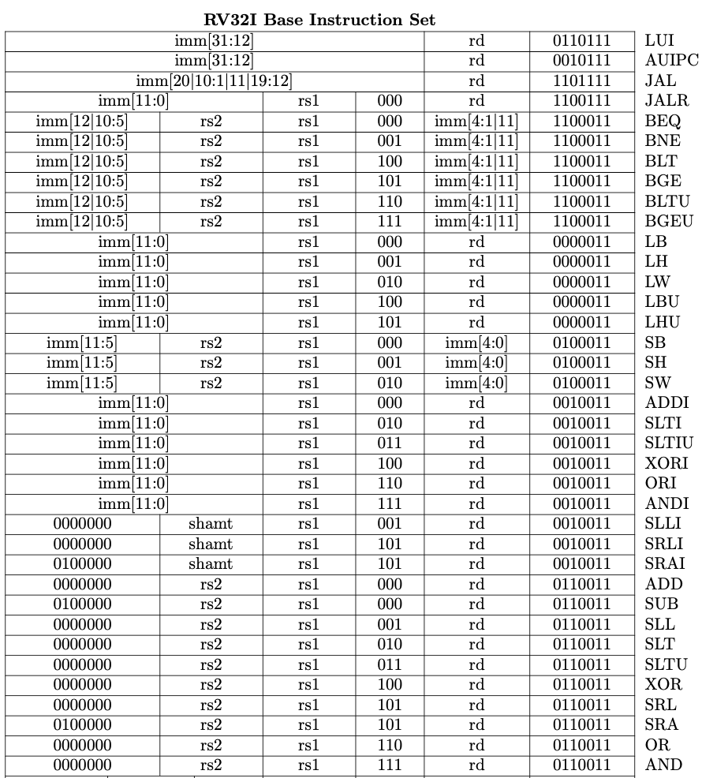

# RISC-V-Simulator

## RISC-V Simulator that implements RISCV32i (integer only) subset

The RISC-V simulator accepts a binary file of compiled RISC-V32I assembly code. 
The simulator reads the binary file into an int array and subsequently loops through until all instructions have been handled. The following RISC-V instructions are supported:

At the moment the program is limited to this instruction subset but will be expanded to include the entire 32-bit extented library.